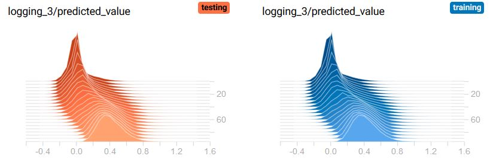

# Concrete-NN
*Data is private and belongs to ETS and uWaterloo Concrete Teams. Contact if you wish to request access.*
## UCI Folder
Simple neural network based on the University of California Irving Concrete dataset to predict concrete compressive strength.
## ETS Folder
Stacked Auto-Encoder based on the ETS ultra light-weight concrete dataset. Used as a sparse recommendation system.

#### Network Diagram

#### Training/Testing Cost Histogram

#### Cost Function Over Num. Epochs

#### TODO
Implement more complex models in Keras

## Citation
*Ouellet, J., Martel, J. L., Ouellet-Plamondon, C., & Carter, A. (2016). Predicting the compressive strength of ultralightweight concrete by an artificial neural network.*

## Acknowledgements
ETS Concrete Canoe Team for data.
